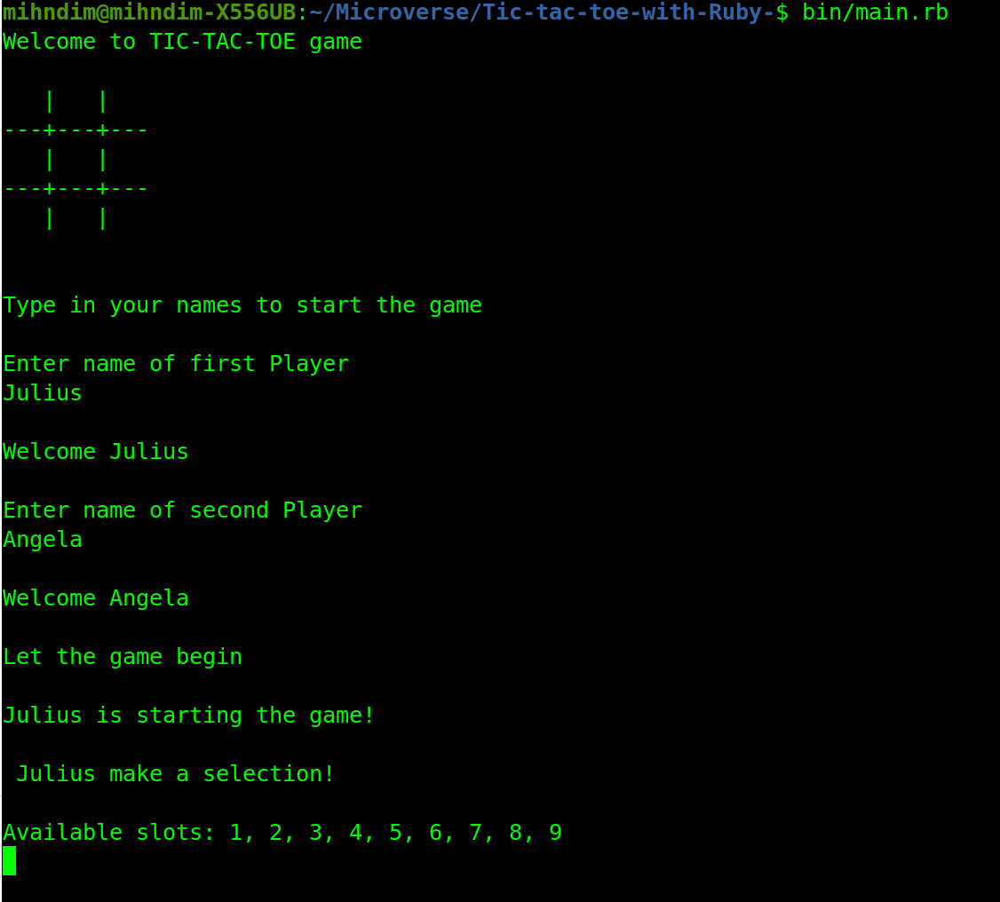
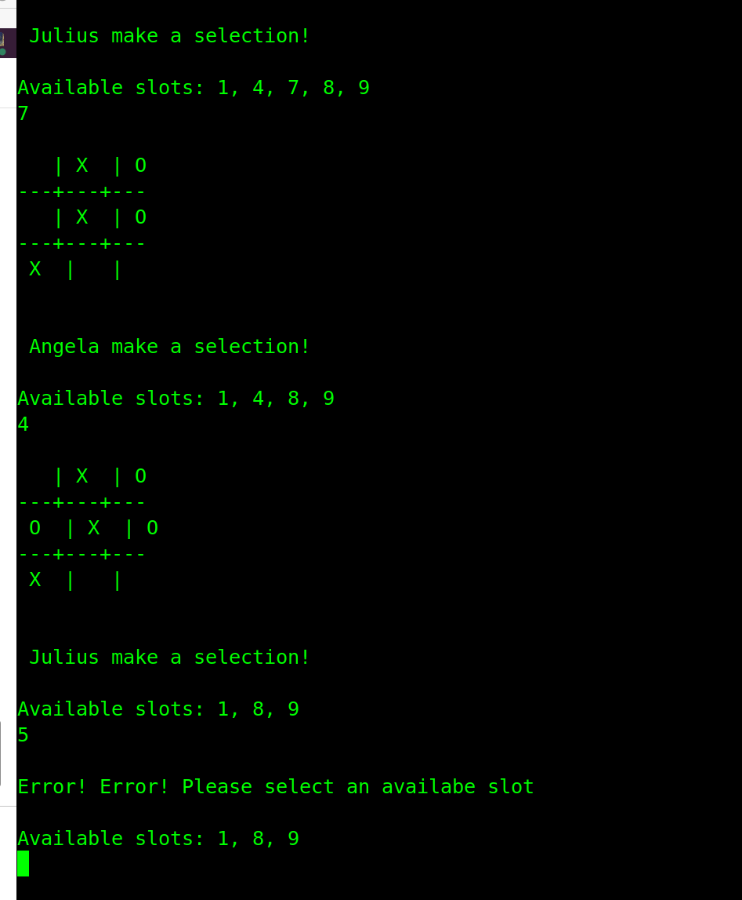
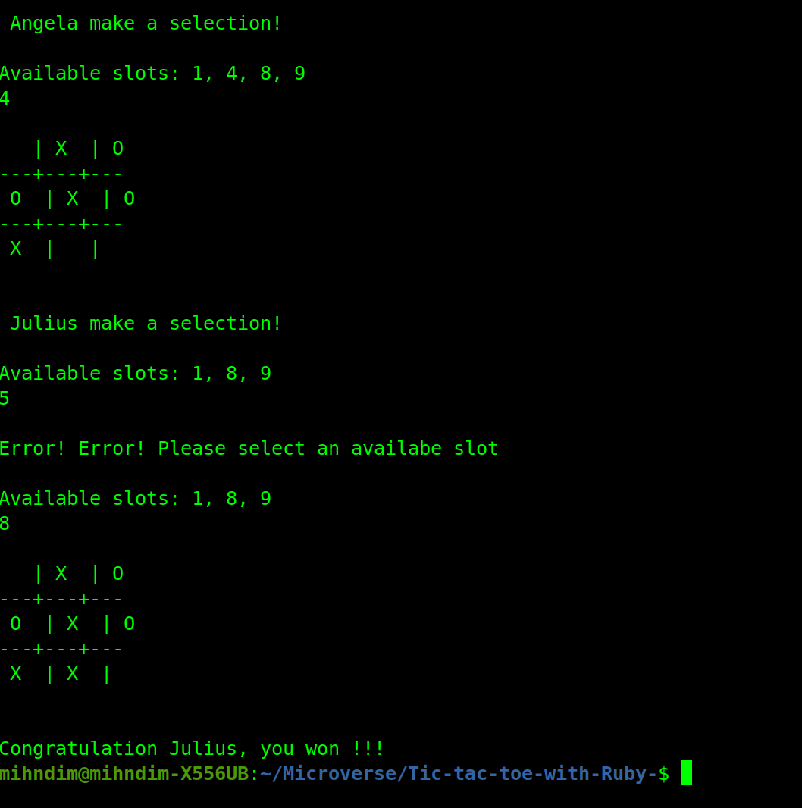

# Tic-tac-toe-with-Ruby-

> In this project, we built a Tic-Tac-Toe game. Tic-tac-toe is a game in which two players seek in alternate turns to complete a row, a column, or a diagonal with either three O's or three X's (noughts and crosses). This has been implemented using Object Oriented Programming in Ruby Language.

Additional description about the project and its features.

## Built With

- Ruby
- VS Code 

## Getting Started

- Clone the repository $ git clone git@github.com:angelacuahutle/Tic-tac-toe-with-Ruby-.git
- Open Terminal using (CTRL + ALT + T)
- $ cd to the clone repository
- Run the command $ bin/main.rb

## Prerequisites

- Install at least one code editor
- Install Ruby to execute the project

## Rules

- The game board is a 3x3 array with 9 available spots.

- The game is played by two players at a time

- One player choses the symbol(or marker O) and the other choses the symbol(or marker X)

- Player select slots on the board and switch turns after each selection.

- A player wins if he/she makes three consecutive selections in the horizontal, vertical or diagonal lines.

- If all slots are full and there is no winner, then it's a draw and the game

### Build with

- Ruby
- Visual Studio Code

## Authors

👤 **Angela Cuahutle**

- GitHub: [@angelacuahutle](https://github.com/angelacuahutle)
- Twitter: [@AngelaCunaDev](https://twitter.com/AngelaCunaDev)
- LinkedIn: [Angela Cuahutle](https://linkedin.com/AngelaCuahutle)

👤 **Mih Julius Ndim**

- GitHub: [@mihdim2020](https://github.com/mihdim2020)
- Twitter: [@mihndim](https://twitter.com/mihndim)
- LinkedIn: [Mih Julius](https://linkedin.com/MihJulius)

## 🤝 Contributing

Contributions, issues, and feature requests are welcome!

Feel free to check the [issues page](https://github.com/angelacuahutle/Tic-tac-toe-with-Ruby-/issues).

## Show your support

Give a ⭐️ if you like this project!

## 📝 License

MIT License

Copyright (c) 2021 Angela Cuahutle and Mih Julius Ndim

Permission is hereby granted, free of charge, to any person obtaining a copy
of this software and associated documentation files (the "Software"), to deal
in the Software without restriction, including without limitation the rights
to use, copy, modify, merge, publish, distribute, sublicense, and/or sell
copies of the Software, and to permit persons to whom the Software is
furnished to do so, subject to the following conditions:

The above copyright notice and this permission notice shall be included in all
copies or substantial portions of the Software.

THE SOFTWARE IS PROVIDED "AS IS", WITHOUT WARRANTY OF ANY KIND, EXPRESS OR
IMPLIED, INCLUDING BUT NOT LIMITED TO THE WARRANTIES OF MERCHANTABILITY,
FITNESS FOR A PARTICULAR PURPOSE AND NONINFRINGEMENT. IN NO EVENT SHALL THE
AUTHORS OR COPYRIGHT HOLDERS BE LIABLE FOR ANY CLAIM, DAMAGES OR OTHER
LIABILITY, WHETHER IN AN ACTION OF CONTRACT, TORT OR OTHERWISE, ARISING FROM,
OUT OF OR IN CONNECTION WITH THE SOFTWARE OR THE USE OR OTHER DEALINGS IN THE
SOFTWARE.